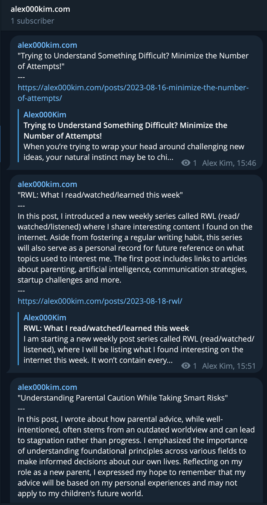

# Telegram Blog Poster

This is a Python script that posts new blog entries from your personal blog's
RSS feed to a Telegram channel. Optionally, it can use the OpenAI API to
generate a summary of the blog post, which is included in the message along with
the post title and link.

## Installation

1. Clone the repository
2. Install the required packages with `pip install -r requirements.txt`
3. Set the required environment variables:
   - `TELEGRAM_CHANNEL_ID`: The ID of the Telegram channel to post to
     - see: https://stackoverflow.com/a/3386290
   - `TELEGRAM_API_ID`: Your Telegram API ID
     - see: https://core.telegram.org/api/obtaining_api_id
   - `TELEGRAM_API_HASH`: Your Telegram API hash
     - see: https://core.telegram.org/api/obtaining_api_id
   - `BLOG_RSS_FEED_URL`: The URL of the RSS feed for your blog
   - `OPENAI_API_KEY`: Your OpenAI API key
     - see:
       https://help.openai.com/en/articles/4936850-where-do-i-find-my-secret-api-key
4. Run the script with `python main.py`

*you'll be asked to sign in to Telegram on the first run. See:
https://docs.telethon.dev/en/stable/basic/signing-in.html

## Usage

The script takes one optional argument:

- `--no-summary` or `-ns`: Disables summary generation and only posts the title
  and link.

## Example
Below is an example of posts generated from the [RSS
feed](https://alex000kim.com/index.xml) of my personal blog. The first post is
generated without a summary, and the other two are generated with a summary.

## License

This project is licensed under the MIT License - see the LICENSE file for
details.